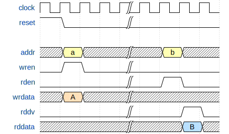
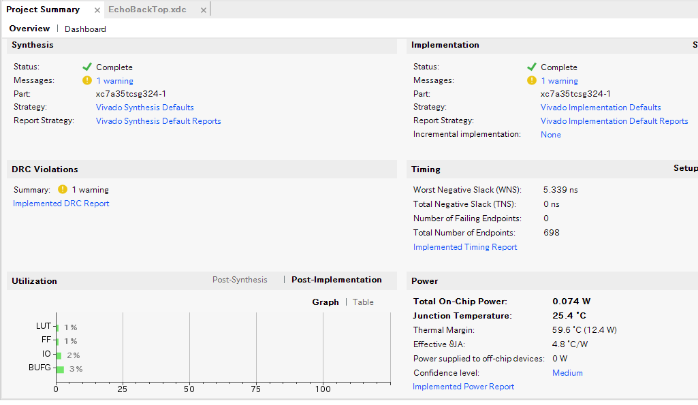

# Chiselを始めたい人に読んでほしい本のサンプルソースプロジェクト

## このプロジェクトは何？

「Chiselを始めたい人に読んでほしい本」で使用された全サンプルソース＋おまけが含まれているプロジェクトです。
chisel-templateを使用しているので、sbtを使った基本的なプロジェクトの構成に沿っています。
各サンプルソースについては、本書との対応付けと取りやすくするため"src/{main, test}のディレクトリの下に対応するchapterのパッケージディレクトリを作成して、そのディレクトリの下に格納しています。書籍のリストx-yの表記の部分にソースコードのパスが記載してありますので、そちらを確認していただくのが早いと思います。

### "おまけ"要素

”おまけ”と書いたとおりページ数（＆締切）の関係で、書籍には掲載していないコードがいくつかありますので、先に記載しておきます。

1. chapter5
    1. BlackBoxWithDefine.scala
    1. SampleChiselTypeOf.scala
1. chapter6全部

chapter6は当初掲載するつもりで作っていたのですが、全体が想像以上のボリュームになってしまったため作業時間の関係で掲載を断念しました。
こちらについてはこのREADMEの後半で概要を説明します。

## RTLGenerator/SimRunner

簡単に動作確認を行うために`RTLGenerator`と`SimRunner`というオブジェクトを作成してあります。それぞれ以下のような処理を実行することが可能です。

- RTLGenerator : RTLの生成を行うメイン関数を含むオブジェクト
  - クラスパラメーターが存在しないChiselのモジュールなら、全部RTLを生成することが可能（なはず）
  - クラスパラメーターが必要なChiselのモジュールは、オブジェクト内で明示されているもののみ生成可能
- SimRunner : Chiselのテスト機構を使って1cycleのみのシミュレーションを実行するオブジェクト
  - 主に4章で解説したChiselの型のサンプルソース中の`printf`関数の表示を確認するために使用

使い方は以下のようになります。

```scala
runMain RTLGenerator <RTL化したいChiselモジュールのクラスパス>
runMain SimRunner <シミュレーションを実行したいChiselモジュールのクラスパス>
```

例えばchapter4の`SampleReg`のRTLを生成する場合は以下のようになります。

```scala
runMain Generator chapter4.SampleReg
```


## chapter6のコードについて

「そこそこシンプルだけど、動いた感のあるものをChiselで！」と考えた結果、UARTと受信した文字をそのまま
送り返すシーケンサーを作成してみました。
ブロック構成は次の図の通りで、作成したUartとシーケンサーを直結しただけです。



### インターフェース

可能な限りシンプルなものにしました。動作波形は以下のようなものです。



ライトは`wren`が0x1になったサイクルのアドレス／データが有効になります。
リードは`rden`が0x1になったサイクルのアドレスのデータは`rddv`が0x1になったサイクルの`rddata`となります。

### UartTop部

Uartは以前に自分で作ったRISC-Vの確認に使用したものをベースにI/Fだけ変更しています。このUARTはXilinxのFPGA向けに提供されている「[AXI UART Lite v2.0](https://www.google.com/url?sa=t&rct=j&q=&esrc=s&source=web&cd=2&cad=rja&uact=8&ved=2ahUKEwjT-J-E_a_mAhXTc3AKHe88AiAQFjABegQIAhAC&url=https%3A%2F%2Fwww.xilinx.com%2Fsupport%2Fdocumentation%2Fip_documentation%2Faxi_uartlite%2Fv2_0%2Fpg142-axi-uartlite.pdf&usg=AOvVaw1lRH2y0ZRfH3Y4nL1Nm6bZ)」の仕様を元に、とりあえず必要ないかな、、、とい仕様を削減したものになっています。

以下が省いた機能です。

- 制御レジスタ：レジスタはあるけど、一切使用していない。
- ステータスレジスタのbit[7:4]：ビットの定義はしているけど、CSR内で接続していない。

chapter6のコードについては、全モジュールに対して簡単なテストを実施しています。chapter6のテストのみを実行する場合は`testOnly`コマンドのワイルドカード指定を使って、次のように実行してください。

```scala
testOnly chapter6.*
```

### シーケンサー

こちらもかなりシンプルな作りにしています。基本的には次の動きをひたすら繰り返しています。

1. UartTopのステータスレジスタをポーリング
1. データを受信していれば、データを受信FIFOから読み出す
1. 読みだしたデータを送信FIFOに書き込む


### テスト環境

chapter6のテスト環境では、以下のソース記載のクラスやトレイトを使って少しだけ使い勝手を向上させています。
処理に興味があれば、それぞれのコードを確認してみてください。

- WDT.scala
  - シミュレーションを強制終了させるウォッチドッグタイマー
- BaseSimDTM.scala
  - WDTモジュールをインスタンスした、テストベンチモジュール
- BaseTester.scala
  - `testOnly`コマンド実行時に引数で以下の機能を設定できるようにしたテストクラス
    - 波形の取得のON/OFF（`--generate-vcd-output`）。デフォルトはON。
    - シミュレーターの選択（`--backend-name`）。デフォルトはVerilator。
    - ログ表示の詳細化（`--is-verbose`）。デフォルトは無効。
  - 実行時には`testOnly <テストクラス> -- -D<オプション設定>`で実行する
    - 以下は例
    ```scala
    testOnly chapter6.EchoBackTopTester -- -D--backend-name=treadle
    ```

### RTLの生成と合成結果

この回路のRTLを生成するコマンドは次になります。

```scala
runMain RTLGenerator chapter6.EchoBackTop
```

このRTLは実際にarty-35Tで動くことを確認しています。合成時には次の画像のようにほぼ警告が出ないRTLとなっていました（RTLの規模自体が小さいのもありますが）。



## サンプルコードの取り扱いについて

このサンプルコードを含んだプロジェクト一式についてはMIT Licenseにしてます。
今回は「Chiselを広めたい！」がモチベーションになっているので、Chiselを他の人に勧める
際に「このサンプル使えるやん！」と思ってもらえるのならぜひ使ってください！

### ライセンス

MIT License

Copyright (c) 2019 diningyo

Permission is hereby granted, free of charge, to any person obtaining a copy
of this software and associated documentation files (the "Software"), to deal
in the Software without restriction, including without limitation the rights
to use, copy, modify, merge, publish, distribute, sublicense, and/or sell
copies of the Software, and to permit persons to whom the Software is
furnished to do so, subject to the following conditions:

The above copyright notice and this permission notice shall be included in all
copies or substantial portions of the Software.

THE SOFTWARE IS PROVIDED "AS IS", WITHOUT WARRANTY OF ANY KIND, EXPRESS OR
IMPLIED, INCLUDING BUT NOT LIMITED TO THE WARRANTIES OF MERCHANTABILITY,
FITNESS FOR A PARTICULAR PURPOSE AND NONINFRINGEMENT. IN NO EVENT SHALL THE
AUTHORS OR COPYRIGHT HOLDERS BE LIABLE FOR ANY CLAIM, DAMAGES OR OTHER
LIABILITY, WHETHER IN AN ACTION OF CONTRACT, TORT OR OTHERWISE, ARISING FROM,
OUT OF OR IN CONNECTION WITH THE SOFTWARE OR THE USE OR OTHER DEALINGS IN THE
SOFTWARE.
